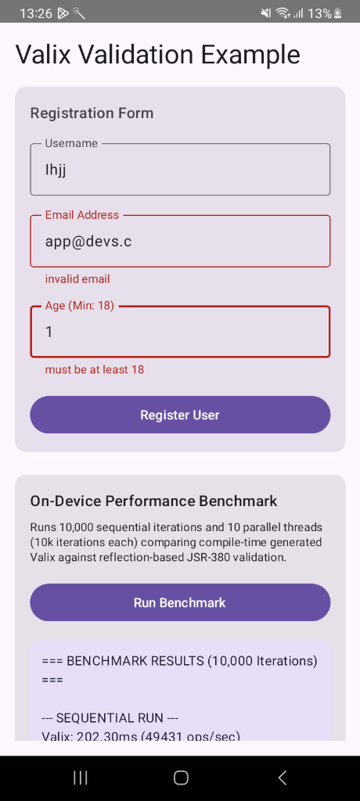

# Valix Integration Examples

<p align="center">
  
</p>

[](https://github.com/developersyndicate/valix-examples/actions/workflows/ci.yml)

Runnable examples showing how to integrate the **Valix** compile-time generated validation framework with popular Kotlin application environments.

For the core compiler, annotation specifications, and runtime libraries, visit the main repository:
👉 **[developersyndicate/valix](https://github.com/developersyndicate/valix)**

---

## 1. Quick Start

Clone this repository and run the netty-based Ktor server example instantly:

```bash
git clone https://github.com/DeveloperSyndicate/Valix-Examples.git
cd Valix-Examples

# Start the Ktor REST server example
./gradlew :ktor-example:run
```

Once started, trigger a validation check by sending a payload containing invalid parameters:

```bash
curl -X POST http://localhost:8080/register \
  -H "Content-Type: application/json" \
  -d '{"username":"","email":"invalid-email","age":16}'
```

Response (Flat list of clean validation errors):
```json
[
  {"field":"username","message":"must not be blank"},
  {"field":"email","message":"invalid email"},
  {"field":"age","message":"must be at least 18"}
]
```

---

## 2. Choosing an Example

This repository contains dedicated integration modules designed to isolate learning contexts. The validation logic is generated at compile time (via KSP) and executed at runtime to avoid reflection overhead.

| Target Environment | Example Module | Focus Showcase |
| --- | --- | --- |
| **Android / Compose** | [`:android-example`](file:///Users/sanjay/Documents/VibeCode/Valix-Example/android-example) | Jetpack Compose form state validation (`rememberValixForm`) |
| **Ktor 3.x Server** | [`:ktor-example`](file:///Users/sanjay/Documents/VibeCode/Valix-Example/ktor-example) | REST API JSON validation pipeline and Ktor Netty server |
| **Spring Boot 3.x** | [`:spring-example`](file:///Users/sanjay/Documents/VibeCode/Valix-Example/spring-example) | Auto-configuration parameter resolution (`@ValidValix`) |
| **Micronaut** | [`:micronaut-example`](file:///Users/sanjay/Documents/VibeCode/Valix-Example/micronaut-example) | AOP-driven method execution validation interceptors |
| **Kotlin Multiplatform**| [`:kmp-example`](file:///Users/sanjay/Documents/VibeCode/Valix-Example/kmp-example) | Shared model checks across JVM, iOS, JS, and WebAssembly |
| **Advanced Features** | [`:advanced-example`](file:///Users/sanjay/Documents/VibeCode/Valix-Example/advanced-example) | Custom annotations, cascading validation (`@Valid`), and GraalVM |

---

## 3. On-Device Android Showcase

The `:android-example` contains a Compose UI application displaying validation states and text field error mappings.



---

## 4. Documentation & Benchmarks

* **[Performance Benchmarks & Methodology](BENCHMARKS.md):** Detailed results comparing Valix against JSR-380 (Hibernate Validator) across JVM runtimes, parallel execution loads, and GraalVM Native environments.
* **[Medium Article: Can Compile-Time Generated Validation Really Be Faster?](https://medium.com/@imsaba16/can-compile-time-generated-validation-really-be-faster-f2d659c06040):** Detailed analysis of Valix integration examples and benchmark results.
* **[Valix Core Repository](https://github.com/developersyndicate/valix):** Main compiler package, issues tracker, and release updates.

---

## 5. Compatibility Matrix

| Technology | Supported Version |
| --- | --- |
| **Valix Library** | `1.0.4` |
| **Kotlin Compiler**| `2.3.21` |
| **KSP Processor** | `2.3.9` |
| **Gradle** | `9.4.1` |
| **Target Java Version**| JDK `17` |
| **Android Gradle Plugin** | `9.1.1` |
